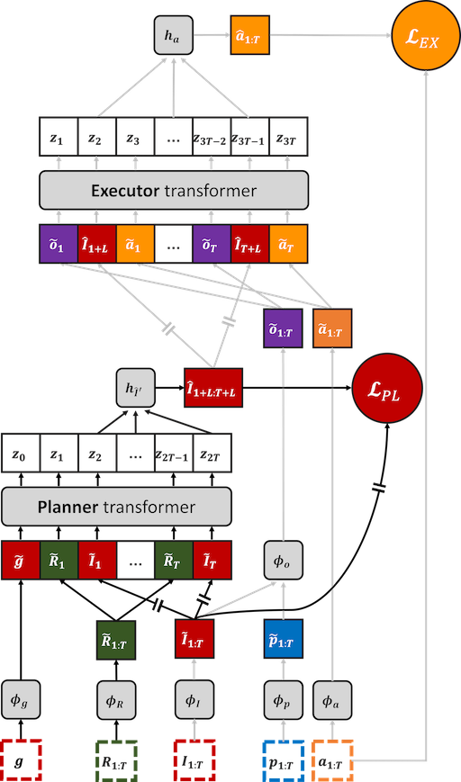
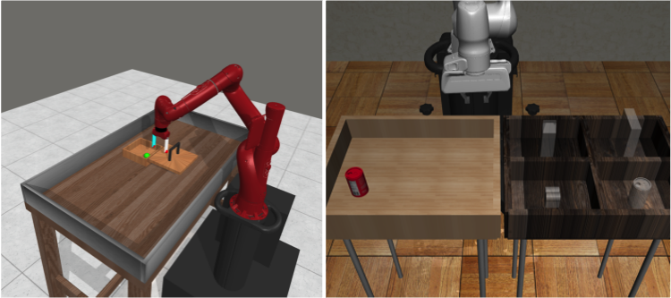
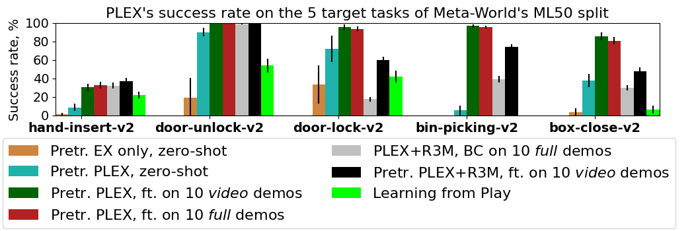
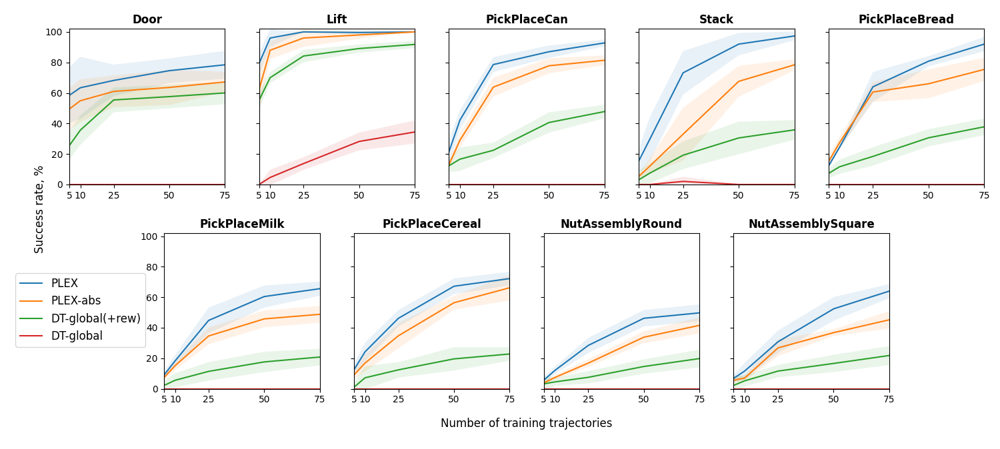

*Code coming soon!*

## Motivation
Data-driven methods for producing robotic manipulation policies have the potential to be effective and scalable, replacing manually engineered controllers. At the same time, recent trends in natural language processing have shown that transformers trained on large amounts of data can exhibit impressive capabilities. We aim to combine these threads and work towards a scalable transformer-based model for robotic manipulation that can take advantage of all available, relevant forms of data.

In particular, we consider three common classes of data available for training robotic manipulators:

 * **Multi-task video demonstrations (MTVD)**, which contain high-quality and potentially annotated demonstrations for a variety of tasks, but have no explicit action information for a robot to mimic

 * **Visuomotor trajectories (VMT)**, which consist of paired sequences of observations and robots’ actions, but do not necessarily correspond to meaningful tasks

 * **Target-task demonstrations (TTD)**, which are high-quality trajectories for a specific task of interest, collected using the robot of interest

Note that the more widely available data tends to be less informative (e.g. videos), while the most informative data (e.g. target demonstrations) is the scarcest.

## Method
Our ***PL*anning-*EX*ecution (PLEX)** architecture separates the model into a *planner*, which predicts the future observations (in a latent space), and an *executor*, which predicts the actions needed to effect those future observations:

During pretraining, the planner is trained using MTVD data, and the executor is trained using VMT data.

During fine-tuning, the entire network is trained end-to-end using TTD data.

## Experiments

We investigate the performance of PLEX on the Meta-World benchmark, using videos from 45 tasks and evaluating on 5 other target tasks:

Interestingly, PLEX works fairly well even zero-shot, and needs only videos of the target task demonstrations.

We also evaluate on the Robosuite benchmark, demonstrating outperformance over the Decision Transformer, and finding that relative position encodings work better than absolute position encodings:
